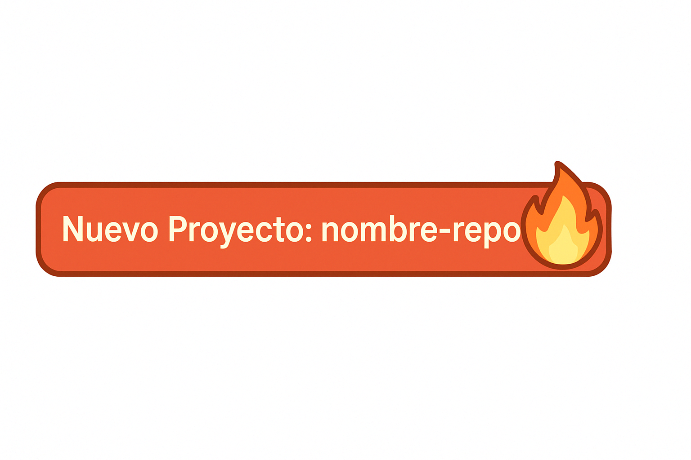

# 👋 Hola, soy Bert0h

---

## 🧠 Acerca de mí

Programador autodidacta 💻 apasionado por backend, frontend, bases de datos y automatización.  
Fan de crear soluciones reales con tecnología. ¡Siempre aprendiendo algo nuevo!

---

## 🚀 Últimos Proyectos Iniciados

🎯 Empezó un nuevo proyecto: `nombre-del-repo`. ¡A romperla! 🔥

---

## 📌 Actividad Reciente

🔽 Últimos movimientos técnicos:

<!--RECENT_ACTIVITY:start-->
<!--END_SECTION:activity-->

---

## 📊 Stats

  

---

## 📈 Gráfica de Actividad

---

## 🗓️ Resumen Semanal

---

## 🧠 Hábitos

---

## 🚀 Principales Repos

