<h2>
   &nbsp;Hi, I'm Jesús Humberto Morales
</h2>

<p align="center">
  
</p>


## 👨🏻‍💻 &nbsp;About Me

```python
#!/usr/bin/python
# -*- coding: utf-8 -*-

class SoftwareEngineer

  def __init__(self):
    self.username = 'bert0h-dev'
    self.name = 'Jesús Humberto Morales Mojica'
    self.role = 'Software Engineer'
    self.company = 'GM Transport | Remote'
    self.location = 'Rosarito, Baja California'
    self.skills = {
      "backend": ['C#', 'WLanguage']
      "databases": ['T-SQL']
      "frontend": ['HTML', 'SCSS/CSS', 'JavaScript - Basic', '.NET']
      "tools": ['Git', 'GitHub', 'TortoiseSVN']
    }
    self.learning = {
      "backend": ['Python', 'Django', 'NodeJS', 'Go']
      "databases": ['PostgreSQL', 'MongoDB']
      "devops" = ['Docker']
      "frontend" = ['Javascript', 'TypeScript', 'ReactJS']
      'tools': ['Nginx']      
    }

  def say_hi(self):
    print("Thanks for dropping by, hope you find some of my work interesting.")

if __name__ == '__main__':
  me = SoftwareEngineer()
  me.say_hi()

```

## 🌐 Social

[](https://www.facebook.com/bto.mojica/)
[](https://www.instagram.com/humbertomor14/)
[](https://discord.com/users/407037424984653829)
[](https://www.linkedin.com/in/jes%C3%BAs-humberto-morales-4793a9110/)
[](https://x.com/HumbertoMor14)
[](https://codepen.io/Bert0h-Morales-14)
[](https://github.com/HumbertoMorales1416)
[](https://gitlab.com/HumbertoMorales1416)

## ⚡ Actividad reciente

🔽 Últimos movimientos técnicos:

<!--RECENT_ACTIVITY:start-->
<!--RECENT_ACTIVITY:end-->

## 📊 Stats

&nbsp;&nbsp;&nbsp;

## 🚀 Principales Repos


---
<!--RECENT_ACTIVITY:last_update-->
Ultima actualización: Wednesday, November 5th, 2025, 5:13:37 AM
<!--RECENT_ACTIVITY:last_update_end-->